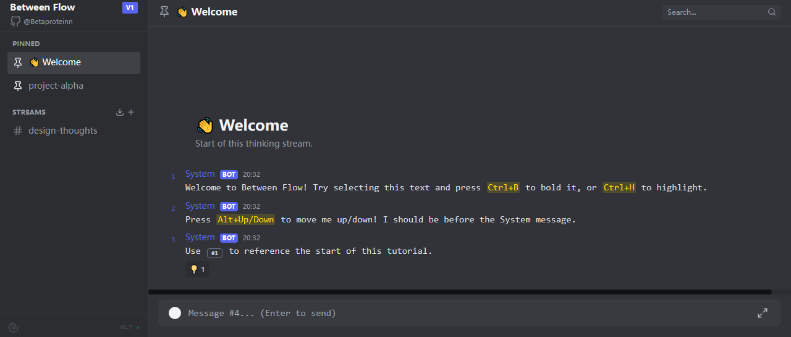
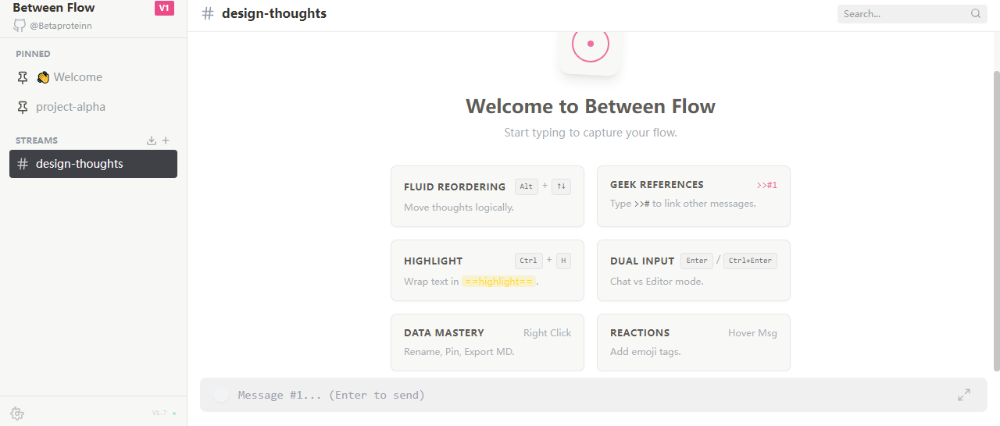

## English

# Between Flow

## What this is

Between Flow is a personal thinking tool prototype for exploring how lines of thought are sustained over time.  
It focuses not on content generation, but on how reasoning paths are preserved, adjusted, and continued.

It is not meant to produce content, but to provide a way to keep thinking.

## Why it exists

In AI-assisted research, long-horizon reasoning, and the analysis of complex ethical questions, an often overlooked issue is that  
**thinking processes tend to become prematurely fixed at the moment they are recorded.**

This can lead to:

- early assumptions becoming difficult to revisit or reorder  
- reasoning paths lacking traceability and reviewability  
- conclusions reflecting recording order rather than genuine exploration  

Between Flow focuses on what becomes visible when the order of thinking is no longer treated as a given,  
but instead considered as a variable that may reveal overlooked assumptions, constraints, or blind spots.

## What it does

- Treats each input as an independent thought node rather than an immutable time-based record  
- Allows the order of thought nodes to be adjusted after writing, while preserving contextual relationships  
- Supports references and replies between nodes, maintaining the traceability of reasoning paths  

These mechanisms are not designed to accelerate output,  
but to expose and retain structural changes that occur during thinking.

## Why it matters (for research)

In AI safety and AI ethics research, final conclusions are often not the only object of interest.  
How conclusions are formed, where reasoning shifts occur, and which assumptions persist are equally important.

Between Flow provides a low-friction way to externalize and retain reasoning paths:  
thoughts can be revisited, adjustments can be examined, and exploratory processes can be repeated.  
In this sense, it can function as an interface for observing cognitive paths, hypothesis evolution,  
and the structural characteristics of human–AI collaboration during extended reasoning.

This project is developed in the context of personal use and research exploration,  
and does not aim at large-scale expansion or broad adoption.

The system operates in a local-first manner, avoiding unnecessary data exposure or platform dependence.

## Status

Personal research prototype, actively used and iterated within real thinking and research workflows.

The concepts and mechanisms in this project do not require holistic understanding.

---

## 日本語

# Between Flow

## What this is

Between Flow は、「思考が時間の中でどのように持続・展開されるか」を探るための  
個人向け思考ツールの研究プロトタイプです。  
コンテンツ生成ではなく、推論の経路がどのように保持・調整・継続されるかに焦点を当てています。

これは内容を生み出すことを目的としたものではなく、  
思考を継続するための一つの手段です。

## Why it exists

AI 支援研究、長期的な推論、複雑な倫理的問題の分析において、  
**思考のプロセスが「記録された瞬間」に線形構造として固定されてしまう**という問題は、しばしば見過ごされがちです。

その結果、以下のような状況が生じます：

- 初期の仮定を後から並べ替えたり再検討したりすることが難しくなる  
- 推論の経路が追跡・検証しにくくなる  
- 結論が実際の探索過程ではなく、記録順序に強く依存してしまう  

Between Flow では、思考の順序を既定のものとして前提せず、  
変数として捉えた場合に、どのような前提・制約・盲点が可視化されるのかに着目しています。

## What it does

- 各入力を、変更不可能な時系列記録ではなく、独立した思考ノードとして扱います  
- 文脈的な関係を保ったまま、後から思考ノードの順序を調整できます  
- ノード間の参照や応答を通じて、推論経路の追跡可能性を維持します  

これらの仕組みは、アウトプットを加速するためのものではなく、  
思考の過程で生じる構造的な変化を外在化し、保持することを目的としています。

## Why it matters (for research)

AI セーフティや AI 倫理の研究において、最終的な結論だけが重要とは限りません。  
結論がどのように形成されたのか、どこで推論が転換したのか、  
どの前提が維持されたのかも同様に重要です。

Between Flow は、推論経路を低摩擦で外在化・保持するための手段を提供します。  
思考は再訪可能であり、調整は検討可能であり、探索過程は再現可能です。  
その意味で、本ツールは長期推論における認知経路、仮説の変化、  
人間と AI の協働構造を観察するためのインターフェースとして機能します。

本プロジェクトは、個人使用および研究探索を背景として開発されており、  
大規模な拡張や広範な普及を目的としたものではありません。

システムはローカルファーストで動作し、不必要なデータ流出や  
プラットフォーム依存を避けています。

## Status

個人研究プロトタイプとして、実際の思考および研究プロセスの中で  
継続的に使用・改良されています。

本プロジェクトの概念や仕組みは、全体を理解することを前提としていません。

---

## 中文

# Between Flow

## What this is

Between Flow 是一个用于研究与实践“思考如何在时间中持续展开”的个人思维工具原型。  
它关注的不是内容生成，而是推理路径如何被保留、调整并继续推进。

它不是帮我产出内容，而是给我一个继续思考的方式。

## Why it exists

在 AI 辅助研究、长期推理以及复杂伦理问题分析中，一个经常被忽视的问题是：  
**思考过程往往在被记录的那一刻，就被线性结构提前固化。**

这可能导致：

- 早期假设难以被重新排列或修正  
- 推理路径缺乏可回溯性，难以审视  
- 结论更多反映记录顺序，而非真实探索过程  

Between Flow 关注的是：  
当我们不再将“思考的顺序”视为既定事实，而将其视为一个变量时，  
会显露出哪些此前被忽略的假设、限制或盲区。

## What it does

- 将每一条输入视为独立的思考节点，而非不可变的时间记录  
- 允许在思考展开之后，对节点顺序进行调整，同时保持上下文关联  
- 支持节点之间的引用与回应，使推理路径保持可追溯性  

这些机制并不用于加速产出，  
而是用于暴露并保留思考过程中发生的结构性变化。

## Why it matters (for research)

在 AI 安全与 AI 伦理研究中，最终结论往往并不是唯一重要的对象。  
结论是如何形成的、推理在哪些地方发生过转向、哪些假设持续存在，同样关键。

Between Flow 提供了一种低摩擦的方式，用于外显并保留推理路径：  
思考可以被回溯，调整可以被审视，探索过程可以被重复。  
在这一意义上，它可以作为一个接口，用于观察认知路径、假设演化，  
以及长期推理过程中人–AI 协作的结构特征。

该项目以个人使用和研究探索为背景展开，  
目前并不以规模化扩展或广泛采用为目标。

系统采用本地优先的运行方式，避免不必要的数据外泄与平台依赖。

## Status

个人研究原型工具，已在真实的思考与研究流程中持续使用和迭代。

该项目中的概念与机制并不要求被整体理解。

---

## License

MIT License

